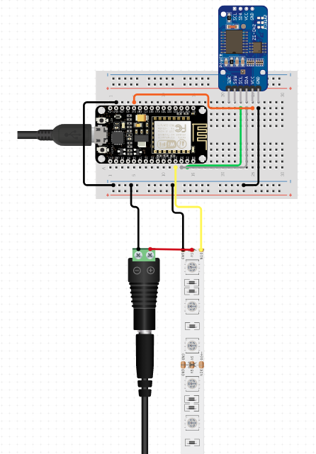

# Soccer Scoreboard (DIY)
A very basic DIY soccer scoreboard project.

# Construction

| Components                    | x     |
| -------------                 | ----- |
|ESP8266 Board                  | 1x    |
|DS1307 Tiny RTC I2C            | 1x    |
|Micro USB cable                | 1x    |
|5V 2.5A power supply           | 1x    |
|WS2812B LED Strip 60 LED's per meter     | 3m    |

## Circuit General Connections



## LED Address Layout

```bash
      __ __ __        __ __ __          __ __ __        __ __ __  
    __        __    __        __      __        __    __        __
    __        __    __        __      __        __    __        __
    __        __    __        __      __        __    __        __
      __ __ __        __ __ __          __ __ __        __ __ __  
    __       149    __       128      __       107    __        86
    __        __    __        __      __        __    __        __
    __        __    __        __      __        __    __        __
      __ __ __       __ __ __           __ __ __        __ __ __   

      __ __ __        __ __ __          __ __ __        12 13 14  
    __        __    __        __      __        __    11        15
    __        __    __        __      __        __    10        16
    __        __    __        __  42  __        __    _9        17
      __ __ __        __ __ __          __ __ __        20 19 18  
    __        65    __        44  43  __        21    _8        _0
    __        __    __        __      __        __    _7        _1
    __        __    __        __      __        __    _6        _2
      __ __ __       __ __ __           __ __ __        _5 _4 _3   
```

# Contributors
| [<br><sub>Alexandre Alvaro</sub>](https://github.com/alexandremendoncaalvaro) | [<br><sub>Guilherme Goll</sub>](https://github.com/guilhermecgoll) |
| :---: | :---: |

# Inspiration and attributions
This project was strongly inspired by the project [7-Segment Digital Clock](https://github.com/leonvandenbeukel/7-Segment-Digital-Clock-V2).  
Licensed under a [Creative Commons Attribution-NonCommercial-ShareAlike 4.0 International License](https://creativecommons.org/licenses/by-nc-sa/4.0/).

We've started building our project from scratch and used pieces of the 7-Segment Digital Clock code to quickly test and adapt it to our scenario. During this process, a new code was created and a good part of the 7-Segment Digital Clock original code was refactored. But most of the concepts and functionalities remain.  
Special thanks to [Leon van den Beukel](https://github.com/leonvandenbeukel) for the amazing work.